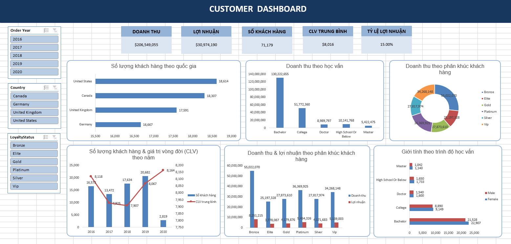
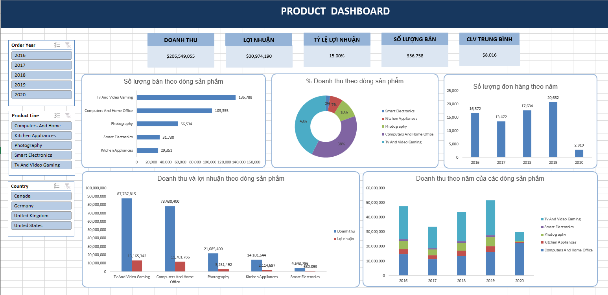

# Dự Án Phân Tích Hiệu Suất Kinh Doanh & Chân Dung Khách Hàng (2016 - 2020)

## Tổng Quan Dự Án
Dự án này tập trung vào việc xử lý, làm sạch tập dữ liệu giao dịch kinh doanh lớn (giai đoạn 2016 - 2020) và trực quan hóa dữ liệu lên hai Dashboard tương tác chính: **Product Dashboard** (Quản lý hiệu suất sản phẩm) và **Customer Dashboard** (Phân tích hành vi khách hàng). 

---
## Thông Tin Dataset

- Giai đoạn dữ liệu: 2016 - 2020
- Tổng số khách hàng: 71,179
- Tổng doanh thu: $206.5M
- Tổng lợi nhuận: $31M
- Tỷ suất lợi nhuận trung bình: 15%
- Tổng số lượng bán: 356,758 sản phẩm

### Các trường dữ liệu chính
- Product Line
- Revenue
- Profit
- Quantity Sold
- Country
- Education
- Loyalty Status
- Customer Lifetime Value (CLV)
- Order Year
- Gender

## Quy Trình Xử Lý Dữ Liệu (Clean Data)

Tập dữ liệu gốc sau khi tiếp nhận đã được tiến hành tiền xử lý và chuẩn hóa tại tệp `CleanData` để đảm bảo tính toàn vẹn và chính xác trước khi đưa vào mô hình phân tích.

### Các bước làm sạch dữ liệu cốt lõi:
1. **Xử lý giá trị khuyết thiếu (Missing Values):** Kiểm tra và điền khuyết hoặc loại bỏ các bản ghi không hợp lệ ở các trường thông tin khách hàng cốt lõi.
2. **Chuẩn hóa định dạng dữ liệu (Data Formatting):**
   * Định dạng lại các cột ngày tháng, năm (`Order Year`).
   * Chuẩn hóa text đối với các trường phân loại như Quốc gia (`Country`), Trình độ học vấn (`Education`), và Phân hạng thành viên (`Loyalty Status`).
3. **Phát hiện và xử lý giá trị ngoại lai (Outliers Detection):** * Kiểm tra các chỉ số `Revenue_Outlier`, `Quantity Sold_Outlier`, và `Customer Lifetime Value_Outlier`.
   * Đảm bảo các giao dịch đột biến không làm lệch pha xu hướng phân tích tổng thể.
4. **Tính toán các chỉ số bổ sung (Feature Engineering):**
   * Tính toán doanh thu thực tế (`Calculated Revenue`).
   * Tính chỉ số Lợi nhuận (`Profit`) dựa trên Tỷ suất lợi nhuận biên cố định (`Profit Margin (%)` ~ 15%).

---

## Quy Trình Dựng Dashboard 

Sau khi dữ liệu được làm sạch, các bảng **Pivot Table** được khởi tạo để tổng hợp dữ liệu đa chiều, làm cơ sở xây dựng các cấu trúc trực quan hóa trên Dashboard.

### 1. Customer Dashboard (Dashboard Khách hàng)



* **Khối KPI chính:** 
    - Tổng số lượng khách hàng (`71,179`)
    - Doanh thu tổng (`$206.5M`)
    - Tổng lợi nhuận (`$31M`) 
    - CLV trung bình (`$8,016`)
    - Tỷ lệ lợi nhuận (`15%`)
* **Các biểu đồ thành phần:**
    - Số lượng khách hàng theo Quốc gia: Biểu đồ thanh ngang (Bar Chart) minh chứng thị trường Bắc Mỹ là lõi kinh doanh của công ty khi United States (18.61K) và Canada (18.31K) chiếm thị phần lớn nhất, theo sau sát sao là United Kingdom và Germany.
    - Doanh thu theo Trình độ học vấn (Education): Biểu đồ cột xác định rõ chân dung khách hàng mục tiêu thuộc nhóm Bachelor (Cử nhân) khi mang lại nguồn thu áp đảo tuyệt đối (130.22M), kế đến là nhóm College (51.77M).
    - Số lượng khách hàng và Giá trị vòng đời (CLV) theo năm: Biểu đồ kết hợp (Combo Chart) cho thấy số lượng khách hàng tăng trưởng ổn định từ 2016 và đạt đỉnh vào năm 2019 (20.68K), sau đó lao dốc mạnh vào năm 2020 (2.82K). Tuy nhiên, đường chạy Average CLV lại đạt mức cao nhất vào năm 2020 (8.16K), làm nổi bật nghịch lý: Dù lượng khách giảm sâu do biến động thị trường, tệp khách hàng giữ chân được lại là những người trung thành và có sức mua lớn nhất.
    - Doanh thu và Lợi nhuận theo Phân hạng thành viên: Biểu đồ cột nhóm (Clustered Column Chart) chỉ ra nhóm phổ thông Bronze đóng góp dòng tiền lớn nhất cho doanh nghiệp với doanh thu vượt trội hơn hẳn các nhóm cao cấp khác (VIP, Elite, Platinum).
    - Giới tính theo trình độ học vấn (Bar Chart)
        - Ở tất cả các bậc học vấn, khách hàng Nữ (Female) luôn có số lượng nhỉnh hơn khách hàng Nam (Male) một chút.
        - Cụ thể ở nhóm Cử nhân (Bachelor): Nữ đạt 22,907 người so với Nam là 21,528 người. Nhóm College: Nữ đạt 9,149 người so với Nam là 8,890 người.

### 2. Product Dashboard (Dashboard Sản phẩm)


* **Khối KPI chính:** 
    - Doanh thu tổng (`$206.5M`)
    - Tổng lợi nhuận (`$31M`) 
    - Số lượng bán (`356.758`) 
    - CLV trung bình (`$8,016`)
    - Tỷ lệ lợi nhuận (`15%`)
* **Các biểu đồ thành phần:**
    - Số lượng bán theo dòng sản phẩm (Bar Chart)
        - Tv And Video Gaming dẫn đầu tuyệt đối về khối lượng tiêu thụ với `135,788` sản phẩm bán ra.
        - Computers And Home Office xếp vị trí thứ hai với `103,355` sản phẩm.
        - Các ngành hàng tiếp theo lần lượt là **Photography** (`56,534`), **Smart Electronics** (`31,730`) và **Kitchen Appliances** (`29,351`).

    - % Doanh thu theo dòng sản phẩm: Sử dụng biểu đồ bánh vòng (Doughnut Chart) trực quan hóa trực diện tỷ trọng đóng góp. 
        - Tv And Video Gaming: Chiếm tỷ trọng lớn nhất với 43% (tương đương 87.79M).
        - Computers And Home Office: Đứng thứ hai với 38% (tương đương 78.43M).
        - Ba ngành hàng còn lại (Photography, Kitchen Appliances, Smart Electronics) đóng góp phần nhỏ nhỏ hơn, trong đó mảng thiết bị thông minh (Smart Electronics) chỉ chiếm 2%.
    - Số lượng đơn hàng theo năm (Column Chart)
        - Giai đoạn 2016 - 2019 chứng kiến sự biến động : Năm 2016 đạt `16,572` đơn, giảm nhẹ vào năm 2017 (`13,472`), sau đó tăng trưởng mạnh mẽ trở lại vào năm 2018 (`17,634`) và đạt đỉnh vào năm 2019 với `20,682` đơn hàng.
        - Năm 2020 ghi nhận mức sụt giảm nghiêm trọng xuống còn `2,819` đơn hàng.
    - Doanh thu và Lợi nhuận theo dòng sản phẩm (Clustered Column Chart)

        - Tv And Video Gaming mang lại doanh thu cao nhất (`$87,787,815`) và đóng góp lượng lợi nhuận lớn nhất (`$13,165,342`).
        - Computers And Home Office bám sát với doanh thu `$78,430,400` và lợi nhuận `$11,761,766`.
        - Mặc dù Smart Electronics có doanh thu thấp nhất (`$4,543,796`), dòng sản phẩm này vẫn duy trì tỷ lệ sinh lời đồng đều so với quy mô của nó (`$680,893` lợi nhuận).
    - Doanh thu theo năm của các dòng sản phẩm (Stacked Column Chart)

    - Biểu đồ cột chồng cho thấy tổng quy mô doanh thu đạt đỉnh vào năm 2019 (vượt mốc `$50M`), đồng pha với biểu đồ số lượng đơn hàng.
    - Tỷ lệ phân bổ giữa các dòng sản phẩm tương đối ổn định qua các năm 2016 - 2019, trong đó mảng Computers And Home Office và Tv And Video Gaming luôn chiếm phần lớn diện tích cột.
---
## Cấu Trúc Thư Mục Dự Án

```text
VER1/
│
├── data/
│   ├── Cleaned_DB.xlsx
│   └── DB.xlsx
│
├── images/
│   ├── customer_dashboard.png
│   └── product_dashboard.png
│
├── clean_data.py
│
└── README.md
```
## Tóm Tắt Insight Chiến Lược Rút Ra từ Dashboard

1. **Insight Xu Hướng Thị Trường (Khủng hoảng & Cơ hội):** Năm 2020, cuộc khủng hoảng Covid-19 toàn cầu bóp nghẹt các ngành giải trí, nhiếp ảnh và gia dụng khiến doanh số các mảng này rơi tự do. Tuy nhiên, nó lại là chất xúc tác cho dòng sản phẩm Computers And Home Office tăng trưởng, đạt 22.61M (chiếm 3/4 doanh thu toàn năm 2020). Điều này phản ánh rõ ràng sự bắt buộc dịch chuyển từ học tập, làm việc trực tiếp sang làm việc tại nhà (Work From Home) và học trực tuyến.
2. **Insight Chất Lượng Khách Hàng:** Năm 2020 chứng kiến sự sụt giảm về số lượng khách hàng vãng lai nhưng ghi nhận mức CLV cao nhất. Điều này chứng minh bộ khung khách hàng giữ chân được là tệp khách hàng trung thành siêu chất lượng có nền tảng tài chính bền vững.
3. **Insight Cơ Cấu Doanh Thu:** Dòng tiền hoạt động chủ yếu dựa vào tệp khách hàng phổ thông (Hạng Bronze / Trình độ Bachelor) chứ không phụ thuộc vào nhóm siêu cao cấp.

---

## Đề Xuất Hành Động 

* **Về Sản Phẩm:** Tiếp tục tối ưu chuỗi cung ứng cho mảng TV & Gaming; thiết kế các gói combo setup không gian làm việc chuyên nghiệp để đón đầu xu hướng dịch chuyển từ xa; thúc đẩy bán chéo (Cross-selling) cho mảng *Smart Electronics*.
* **Về Khách Hàng:** Tập trung ngân sách tiếp thị số vào tệp khách hàng cử nhân tại Bắc Mỹ; xây dựng chương trình thăng hạng thành viên tích cực cho nhóm khách hàng hạng Bronze để tối ưu hóa tần suất mua hàng.

---
## Kết Luận

Dự án giúp chuyển đổi dữ liệu giao dịch thô thành hệ thống Dashboard trực quan hỗ trợ ra quyết định kinh doanh. Thông qua việc phân tích hiệu suất sản phẩm và hành vi khách hàng, doanh nghiệp có thể xác định các nhóm sản phẩm chiến lược, tối ưu nguồn lực marketing và nâng cao giá trị khách hàng dài hạn.